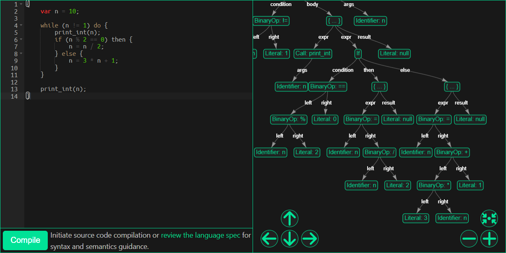

# EzCompiler

EzCompiler is a web-based compiler that enables users to write, compile, and interpret code in a custom language
designed specifically for this platform.

**Key Features:**

- **Interpreter**: Execute code directly in the browser, providing instant feedback on the output.
- **Tokenizer Output:** Inspect the breakdown of code into tokens, providing insight into the parsing process.
- **Abstract Syntax Tree (AST):** Visualize the structure of code through the generated AST, aiding in understanding the
  syntactic relationships within your code.
- **Intermediate Representation (IR):** Examine the IR to see how code is optimized and prepared for assembly, offering
  a glimpse into compiler optimizations.
- **Compiled Assembly:** View the assembly code generated from your high-level code, bridging the gap between high-level
  language and machine instructions.
- **Executable Download:** Users can download the compiled program and run it on Linux, experiencing the full cycle from
  code to execution.

Developed using Vue.js for the frontend, Python and Flask for the backend, and Docker for easy deployment and isolation.

## Live Demo

Experience EzCompiler firsthand and explore its capabilities:

### [https://ezcompiler.fly.dev/](https://ezcompiler.fly.dev/)

[](https://ezcompiler.fly.dev/)

## Language Specification

The complete specification for the custom language utilized within EzCompiler is readily accessible in the compiler's
user interface, located adjacent to the compile button.

The following example demonstrates a program written in this language. It implements the Collatz conjecture algorithm,
which is a sequence of operations on an initial number to eventually reach the number 1. The program prints each step of
the sequence:

```
{
    var n = 50;
    print_int(n);
    while n > 1 do {
        if n % 2 == 0 then {
            n = n / 2;
        } else {
            n = 3 * n + 1;
        }
        print_int(n);
    }
}
```

## Setup with Docker

Running this project with Docker simplifies the setup process, as Docker containers handle all the dependencies and
environment configurations. To get started, you will need to have Docker installed on your machine.

## Requirements:

- Docker: Follow the official Docker installation guide for your operating system https://www.docker.com/.

### Building the Docker Image

To build the Docker image for this project, navigate to the project's root directory in your terminal and run:

    docker build -t ezcompiler .

This command builds a Docker image named ezcompiler based on the instructions in the Dockerfile. It includes the
backend
server, the compiler, and the built frontend.

### Running the Project

After building the image, you can run the project with:

    docker run -p 5000:5000 ezcompiler

This command starts a container from the ezcompiler image. It maps port 5000 of the container to port 5000 on your host
machine, allowing you to access the application via http://localhost:5000.
